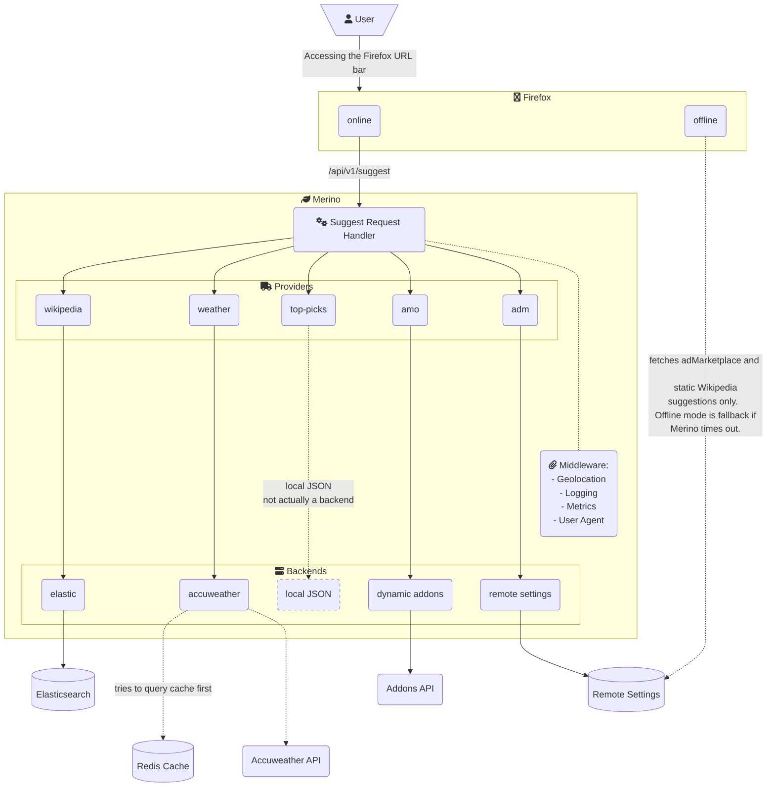

# Merino

Merino is a service that provides address bar suggestions to Firefox. Some of this content
comes from third party providers. In this case, Merino serves as a privacy preserving
buffer. User input in the address bar is handled by Merino and any clicked impression
will be delegated to a Mozilla-controlled service which will then send an interaction
ping if defined in the request and not to a provider directly. See API documentation
for more details.

## Table of Contents
[api.md - API Documentation][1] describes endpoints, query parameters, request and response headers, response objects and details on the suggestion objects.

[firefox.md - Firefox and Merino Environments][2] describes how to enable
Merino in Firefox and lists the endpoints for the service in Production,
State and Dev.

[data.md - Data, Metrics, Logging][4] describes all metrics and logs.

[dev/index.md - Basic Developer Docs][5] describes basics of working on Merino.

[dev/dependencies.md - Development Dependencies][6] describes the development
dependencies required for Merino.

[dev/logging-and-metrics.md - Logging and Metrics][7] describes metrics, logging, and telemetry.

[dev/release-process.md - Release Process][8] describes the release process of Merino in detail.

[dev/testing.md - Testing][9] describes unit, integration, contract and load tests for Merino.

[dev/profiling.md - Profiling][10] describes how to profile Merino to address performance issues.

[operations/configs.md - Configuring Merino][3] describes configuration management
of the project, Dynaconf setup, and the configuration of the HTTP server, logging, metrics, Remote Settings, and Sentry.

[operations/elasticsearch.md - Elasticsearch Operations][11] describes some functionality and operations that
we do on the Elasticsearch cluster.

[operations/jobs.md - Merino Jobs][12] describes the jobs that are configured in Merino. Indicate where the jobs
exist and link to the details for how the jobs are run.

[1]: ./api.md
[2]: ./firefox.md
[3]: ./operations/configs.md
[4]: ./data.md
[5]: ./dev/index.md
[6]: ./dev/dependencies.md
[7]: ./dev/logging-and-metrics.md
[8]: ./dev/release-process.md
[9]: ./dev/testing.md
[10]: ./dev/profiling.md
[11]: ./operations/elasticsearch.md
[12]: ./operations/jobs.md

## Architecture

## About the Name

This project drives an important part of Firefox's "felt experience". That is,
the feeling of using Firefox, hopefully in a delightful way. The word "felt" in
this phrase refers to feeling, but it can be punned to refer to the
[textile](https://en.wikipedia.org/wiki/Felt). Felt is often made of wool, and
Merino wool (from Merino sheep) produces exceptionally smooth felt.
