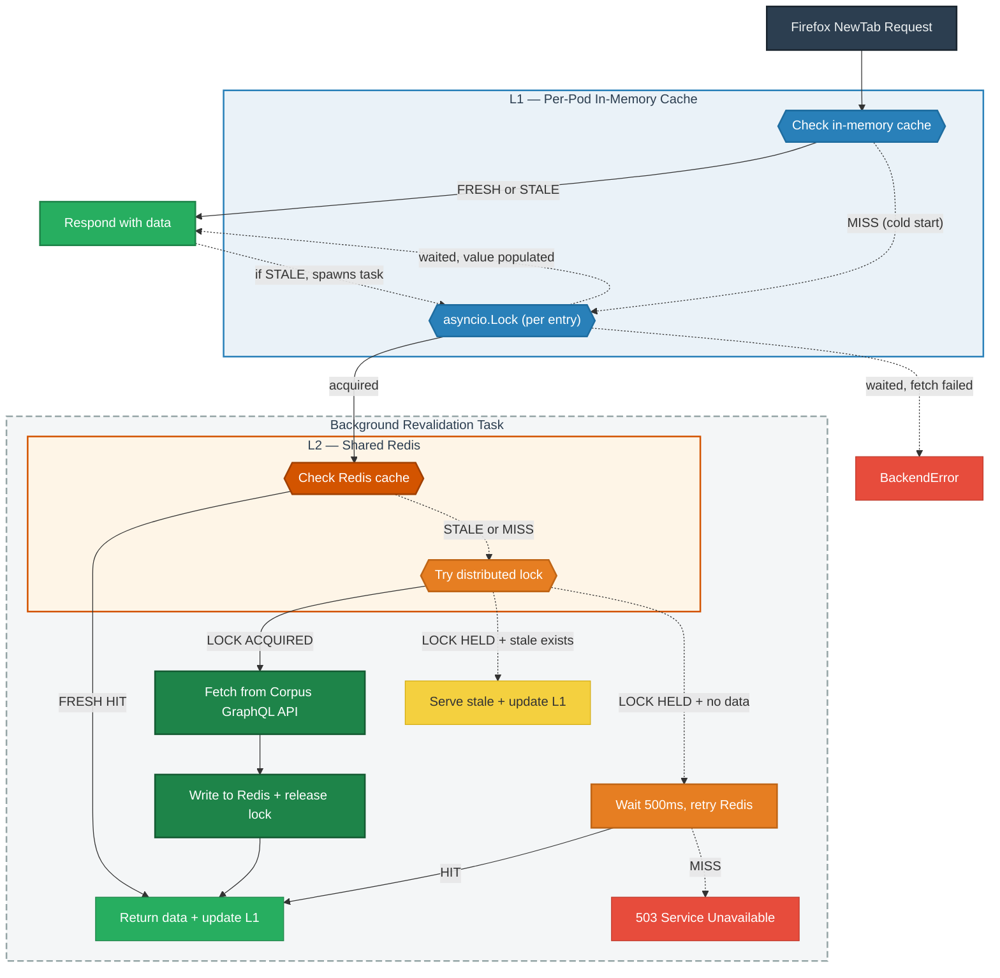

# Corpus Cache (Redis L2)

Shared Redis cache between the per-pod in-memory cache and the Corpus GraphQL API.

## Why

Merino pods each independently fetch from the Corpus API on a short interval. This puts unnecessary load on Apollo/Client-API and creates risk as we expand internationally or scale pod count. Unlike most suggest providers, the number of unique backend requests is small (one per surface per refresh interval), making them highly cacheable — and the curated-corpus-api backend doesn't handle traffic spikes well.

## How it works

Two layers of caching sit in front of the Corpus GraphQL API:

- **L1 (in-memory)** — per-pod. Serves requests immediately. On stale, spawns a background task to revalidate. Uses an `asyncio.Lock` per cache entry to coordinate concurrent updates within a single pod.
- **L2 (Redis)** — shared across all pods. On stale, one pod acquires a distributed lock and revalidates while others continue serving stale data. Uses `SET NX EX` to coordinate across pods.

Both layers use the stale-while-revalidate pattern: serve the cached value immediately and refresh in the background.

### Cold-miss behavior

On cold start (no L1 or L2 data), the L1 `asyncio.Lock` ensures only one coroutine per pod enters L2. Other coroutines in the same pod wait on the lock and receive the result when it completes (or a `BackendError` if it fails).

At the L2 level, one pod acquires the distributed lock and fetches from the API. Pods that lose the lock race wait 500ms and retry Redis once. If still no data, they raise `CorpusCacheUnavailable`, which the API layer translates to **HTTP 503** with `Retry-After: 60`.

Note: if Redis is timing out (not just down), the lock holder blocks for the duration of each Redis timeout. During this time, all other coroutines in the pod are waiting on the `asyncio.Lock`. The circuit breaker only sees failures from the single lock holder, so it accumulates failures slowly.

### Circuit breaker

A simple circuit breaker protects against hammering a degraded Redis. After `circuit_breaker_failure_threshold` consecutive Redis errors, the circuit opens and all Redis calls are skipped for `circuit_breaker_recovery_timeout_sec`. During this period, every request falls through directly to the Corpus API (same behavior as cache disabled). After the recovery period, the circuit closes and requests resume hitting Redis. If Redis is still degraded, failures re-accumulate and the circuit re-opens.

## Configuration

Config section: `[default.curated_recommendations.corpus_cache]` in `merino/configs/default.toml`.

| Setting | Default | Description |
|---|---|---|
| `cache` | `"none"` | `"redis"` to enable, `"none"` to disable |
| `soft_ttl_sec` | `120` | Seconds before an entry is stale and triggers revalidation |
| `hard_ttl_sec` | `86400` | Seconds before Redis evicts the key (1 day safety net) |
| `lock_ttl_sec` | `30` | Auto-release timeout if the lock holder crashes |
| `key_prefix` | `"curated:v1"` | Bump the version on schema changes to avoid deserialization errors |
| `circuit_breaker_failure_threshold` | `10` | Consecutive Redis failures before the circuit opens |
| `circuit_breaker_recovery_timeout_sec` | `30` | Seconds to skip Redis after the circuit opens |

Env var override pattern: `MERINO__CURATED_RECOMMENDATIONS__CORPUS_CACHE__CACHE=redis`

Uses the shared Redis cluster (`[default.redis]`). No separate instance needed.

## Design decisions

| Decision | Choice | Why |
|---|---|---|
| Cache layer | Redis L2 behind existing in-memory L1 | Keeps per-pod latency low, Redis only consulted on L1 miss or stale |
| Write pattern | Distributed stale-while-revalidate | One pod revalidates, others serve stale. Avoids thundering herd |
| L1 lock | `asyncio.Lock` per cache entry | Coordinates concurrent revalidation within a single pod |
| L2 lock | `SET NX EX` with TTL | Distributed, self-expiring. Worst case on timeout: one extra API call |
| Cache format | Pydantic model dicts via orjson | Saves CPU across pods vs re-parsing raw GraphQL |
| Cold miss (lock held) | 503 with Retry-After | Prevents connection pile-up; Firefox retries after backoff |
| Redis failure | Circuit breaker, fall through to API | Redis is an optimization. Circuit breaker prevents hammering a degraded instance |
| Hard TTL | 1 day (86400s) | Long safety net so data survives extended API outages |