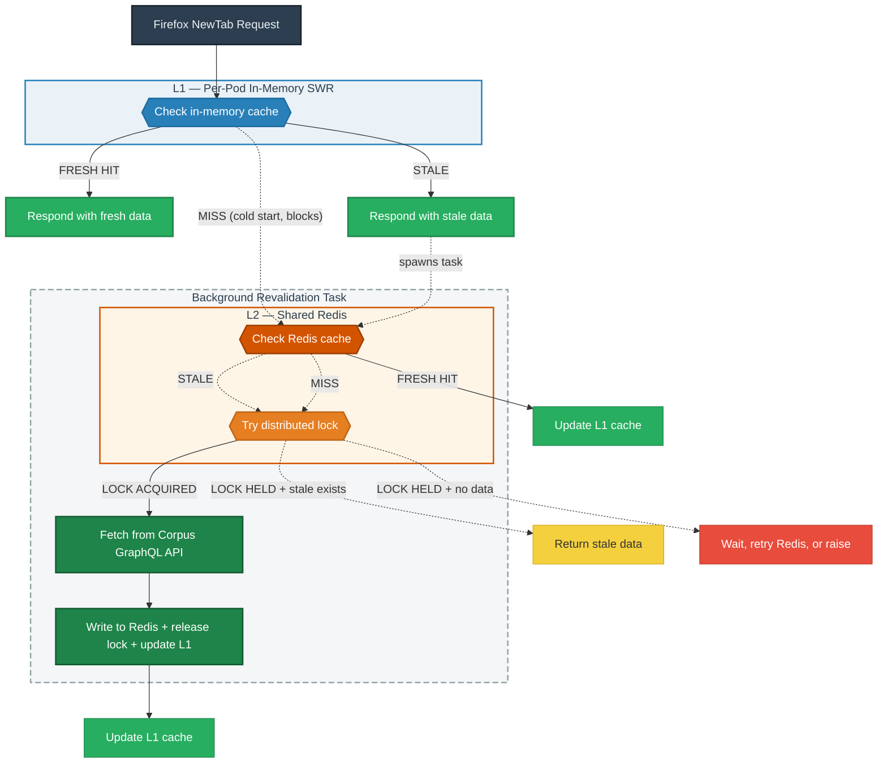

# Corpus Cache (Redis L2)

Shared Redis cache between the per-pod in-memory cache and the Corpus GraphQL API.

## Why

Merino pods each independently fetch from the Corpus API on a short interval. This puts unnecessary load on Apollo/Client-API and creates risk as we expand internationally or scale pod count.

## How it works

Two layers of caching sit in front of the Corpus GraphQL API:

- **L1 (in-memory SWR)** — per-pod. Serves requests immediately. On stale, spawns a background task to revalidate.
- **L2 (Redis)** — shared across all pods. The background task checks Redis before hitting the API.

When L2 is stale, one pod acquires a distributed lock, fetches from the API, and writes to Redis. Other pods serve stale data until the winner finishes.

On cold start (no L1 or L2 data), the request blocks until data is fetched. All pods may hit the API simultaneously in this case — same as today without the cache.

## Configuration

Config section: `[default.curated_recommendations.corpus_cache]` in `merino/configs/default.toml`.

Key settings:
- `cache` — `"redis"` to enable, `"none"` to disable (default: disabled)
- `soft_ttl_sec` — when a cached entry is considered stale and triggers revalidation
- `hard_ttl_sec` — when Redis evicts the key entirely (safety net)
- `lock_ttl_sec` — auto-release timeout if the lock holder crashes
- `key_prefix` — bump the version on schema changes to avoid deserialization errors

Env var override pattern: `MERINO__CURATED_RECOMMENDATIONS__CORPUS_CACHE__CACHE=redis`

Uses the shared Redis cluster (`[default.redis]`). No separate instance needed.

## Design decisions

| Decision | Choice | Why |
|---|---|---|
| Cache layer | Redis L2 behind existing in-memory L1 | Keeps per-pod latency low, Redis only consulted on L1 miss |
| Write pattern | Distributed stale-while-revalidate | One pod revalidates, others serve stale. Avoids thundering herd |
| Lock mechanism | `SET NX EX` with TTL | Simple, self-expiring. Worst case on timeout: one extra API call |
| Cache format | Pydantic model dicts via orjson | Saves CPU across pods vs re-parsing raw GraphQL |
| Failure mode | All Redis errors fall through to API | Redis is an optimization, never a requirement |

## Rollout

1. Deploy with cache disabled (no behavior change)
2. Enable in staging
3. Monitor metrics, validate API call reduction
4. Enable in production

## Key files

- `merino/curated_recommendations/corpus_backends/redis_cache.py` — cache logic
- `merino/curated_recommendations/__init__.py` — wiring (`_init_corpus_cache`)
- `merino/configs/default.toml` — config section with defaults and documentation
