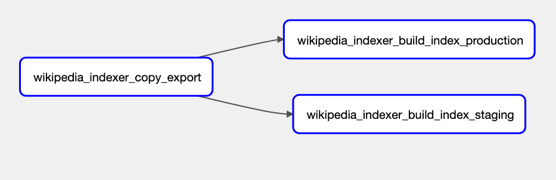

# Merino Jobs Operations

## Delete Dynamic Wikipedia Data

Wikipedia data is copied to a GCS bucket prior to indexing in the `wikipedia_indexer_copy_export` job. 

There are situations in which you may need to delete the Wikipedia export data for a fresh run. This can be due to a processing error in the Kubernetes cluster, for instance.  

### Deletion Steps
1. Visit the [Airflow dashboard for `merino_jobs`][merino_jobs-graph].
2. From the Grid View Tab, Click on the `wikipedia_indexer_copy_export` task

3. In the log tab, you can see the name of the file in question in the format `enwiki-<date>-cirrussearch-content.json.gz`. Make note of the file name. If the job failed, a red box will show for the particular job.

4. Visit the [Google Cloud Console][https://console.cloud.google.com] and search for the  `moz-fx-data-prod-external-data` bucket in `shared-prod`. It will be under `contextual-services/merino-jobs/wikipedia-exports/<filename>`. Find the matching  `enwiki-<date>-cirrussearch-content.json.gz` file, click on it for 'Object details' and then delete it. 

5. Return to the Airflow console for `merino_jobs` and select 'Clear'. The job will re-run and fresh data will be created.
