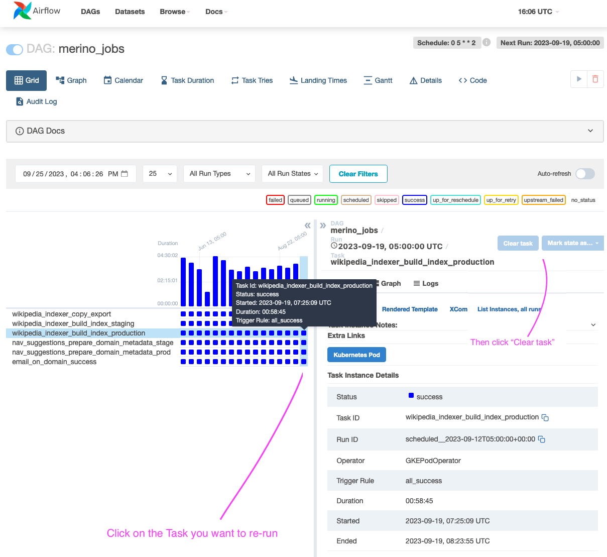
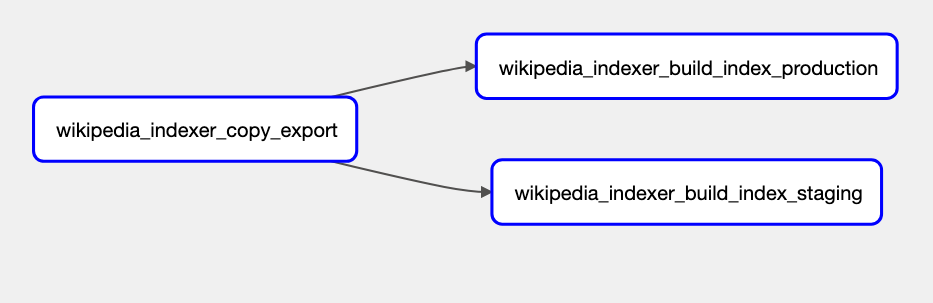
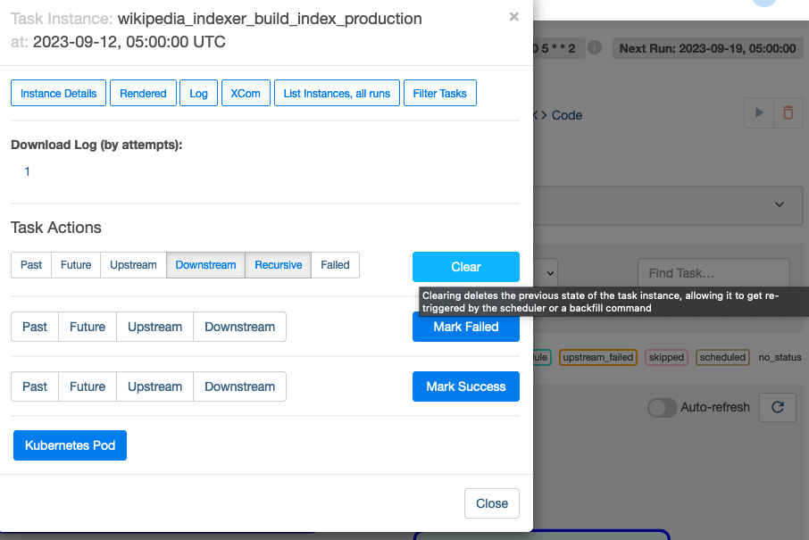

# Merino Jobs Operations

## Dynamic Wikipedia Indexer Job

Merino currently builds the Elasticsearch indexing job that runs in Airflow.
Airflow takes the `latest` image built as the base image.
The reasons to keep the job code close to the application code are:

1. Data models can be shared between the indexing job and application more easily. 
   This means that data migrations will be simpler.
2. All the logic regarding Merino functionality can be found in one place.
3. Eliminates unintended differences in functionality due to dependency mismatch.

If your reason for re-running the job is needing to update the blocklist to avoid certain suggestions from being displayed,
please see the [wikipedia blocklist runbook][wiki_blocklist_runbook].

## Running the job in Airflow
Normally, the job is set as a cron to run at set intervals as a [DAG in Airflow][airflow_docs].
There may be instances you need to manually re-run the job from the Airflow dashboard.

### Grid View Tab (Airflow UI)
1. Visit the [Airflow dashboard for `merino_jobs`][merino_jobs-grid].
2. In the Grid View Tab, select the task you want to re-run.
3. Click on 'Clear Task' and the executor will re-run the job.

### Graph View Tab (Airflow UI)
1b. 1. Visit the [Airflow dashboard for `merino_jobs`][merino_jobs-graph].
2b. From the Graph View Tab, Click on the `wikipedia_indexer_build_index_production` task. 

3b. Click on 'Clear' and the job will re-run.

Note: You can also re-run the stage job, but the changes won't reflect in production. Stage should be re-run in the event of an error before running in prod to verify the correction of an error. 

See Airflow's [documentation on re-running DAGs][airflow_rerun_dag] for more information and implementation details.

To see the code for the `merino_jobs` DAG, visit the [telemetry-airflow repo][merino_jobs_repo]. The source for the job is also in the ['code' tab][merino_jobs_code] in the airflow console.

To see the Wikipedia Indexer code that is run when the job is invoked, visit [Merino `jobs/wikipedia_indexer`][wini_job_dir].

[wiki_blocklist_runbook]: https://github.com/mozilla-services/merino-py/blob/main/docs/operations/blocklist-wikipedia.md
[wini_job_dir]: https://github.com/mozilla-services/merino-py/tree/main/merino/jobs/wikipedia_indexer
[airflow_docs]: https://airflow.apache.org/docs/apache-airflow/stable/public-airflow-interface.html#dags
[airflow_rerun_dag]: https://airflow.apache.org/docs/apache-airflow/stable/core-concepts/dag-run.html#re-run-dag
[merino_jobs_repo]: https://github.com/mozilla/telemetry-airflow/blob/main/dags/merino_jobs.py
[merino_jobs_code]: https://workflow.telemetry.mozilla.org/dags/merino_jobs/code?root=
[merino_jobs-grid]: https://workflow.telemetry.mozilla.org/dags/merino_jobs/grid
[merino_jobs-graph]: https://workflow.telemetry.mozilla.org/dags/merino_jobs/graph?root=