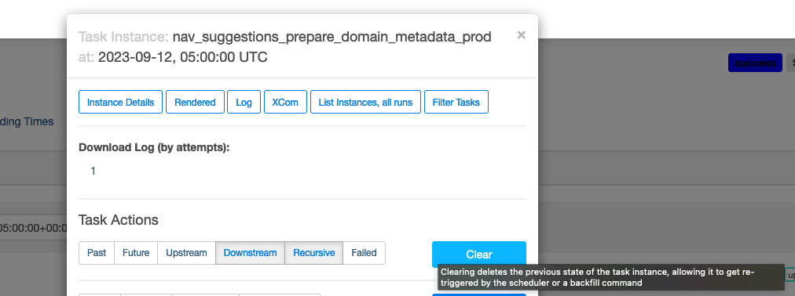

# Merino Jobs Operations

## Navigational Suggestions
This document provides instructions and documentation on the navigational suggestions job.
This job creates a file that is ingested by the Top Picks/Navigational Suggestions provider.
The provider indexes a collection of the top 1000 searched domains and generates the `top_picks.json` file.  Then the provider backend can serve suggestions that match query terms that are searched by the client to second-level domains.

If you need to run the navigational suggestions job ad-hoc, the quickest recommended solution is to run it in Airflow, download the `top_picks.json` file sent by email,
and then merge the new file into the Merino repo with the newly generated one.

If needing to update the blocklist to avoid certain domains and suggestions from being displayed,
please see the [navigational suggestions blocklist runbook][nav_sug_blocklist_runbook].

## Running the job in Airflow
Normally, the job is set as a cron to run at set intervals as a [DAG in Airflow][airflow_docs].
There may be instances you need to manually re-run the job from the Airflow dashboard.

### Grid View Tab (Airflow UI)
1. Visit the [Airflow dashboard for `merino_jobs`][merino_jobs-grid].
2. In the Grid View Tab, select the task you want to re-run.
3. Click on 'Clear Task' and the executor will re-run the job.


### Graph View Tab (Airflow UI) - Alternative
1. Visit the [Airflow dashboard for `merino_jobs`][merino_jobs-graph].
2. From the Graph View Tab, Click on the `nav_suggestions_prepare_domain_metadata_prod` task.

3. Click on 'Clear' and the job will re-run.


At the conclusion of the job, you should recieve an email with a link to the newly generated file. Ensure you are a member of the `disco-team` email distro group to recieve the email.

Note: You can also re-run the stage job, but the changes won't reflect in production. Stage should be re-run in the event of an error before running in prod to verify the correction of an error.


See Airflow's [documentation on re-running DAGs][airflow_rerun_dag] for more information and implementation details.


To see the code for the `merino_jobs` DAG, visit the [telemetry-airflow repo][merino_jobs_repo]. The source for the job is also in the ['code' tab][merino_jobs_code] in the airflow console.

To see the navigational suggestions code that is run when the job is invoked, visit [Merino `jobs/navigational_suggestions`][nav_sug_dir].

[nav_sug_blocklist_runbook]: https://github.com/mozilla-services/merino-py/blob/main/docs/operations/blocklist-nav-suggestions.md
[nav_sug_dir]: https://github.com/mozilla-services/merino-py/tree/main/merino/jobs/navigational_suggestions
[airflow_docs]: https://airflow.apache.org/docs/apache-airflow/stable/public-airflow-interface.html#dags
[airflow_rerun_dag]: https://airflow.apache.org/docs/apache-airflow/stable/core-concepts/dag-run.html#re-run-dag
[merino_jobs_repo]: https://github.com/mozilla/telemetry-airflow/blob/main/dags/merino_jobs.py
[merino_jobs_code]: https://workflow.telemetry.mozilla.org/dags/merino_jobs/code?root=
[merino_jobs-grid]: https://workflow.telemetry.mozilla.org/dags/merino_jobs/grid
[merino_jobs-graph]: https://workflow.telemetry.mozilla.org/dags/merino_jobs/graph?root=

## Running the favicon extractor locally

```bash
$ poetry run probe-images mozilla.org wikipedia.org
```

There is a Python script (`domain_tester.py`) which imports the `DomainMetadataExtractor`,  `Scraper` and `FaviconDownloader` and runs them locally, without saving the results to the cloud.

This is meant to troubleshoot domains locally and iterate over the functionality in a contained environment.

Example output:
```bash
$ poetry run probe-images mozilla.org

Testing domain: mozilla.org
✅ Success!
 Title           Mozilla - Internet for people, not profit (UK)
 Best Icon       https://www.mozilla.org/media/img/favicons/mozilla/m24/favicon-196x196.e143075360ea.png
 Total Favicons  3

All favicons found:
- https://www.mozilla.org/media/img/favicons/mozilla/m24/apple-touch-icon.05aa000f6748.png (rel=apple-touch-icon
size=180x180 type=image/png)
- https://www.mozilla.org/media/img/favicons/mozilla/m24/favicon-196x196.e143075360ea.png (rel=icon size=196x196
type=image/png)
- https://www.mozilla.org/media/img/favicons/mozilla/m24/favicon.d0be64e474b1.ico (rel=shortcut,icon)

Summary: 1/1 domains processed successfully
```

## Adding new domains

- You can add new domains to the job by adding them to the `/merino/jobs/navigational_suggestions/custom_domains.py` file.
- Either manually, or you can use a script inside the `/scripts` folder.
- The script is called `import_domains.sh` and it works with a CSV file with a `REGISTERED_DOMAIN` header, and starting from the second row, the firsts column is the domain name (e.g `getpocket.com`)

This step was introduced to give the HNT team an easy way of importing their updated domains.

Execute the script like this:
```bash
$ ./scripts/import_domains.sh DOWNLOADED_FILE.csv
```

This will add the domains to the `custom_domains.py` file, check if the domain exists, and if not, it adds it. Afterwards, all domains are getting alphabetically sorted.
