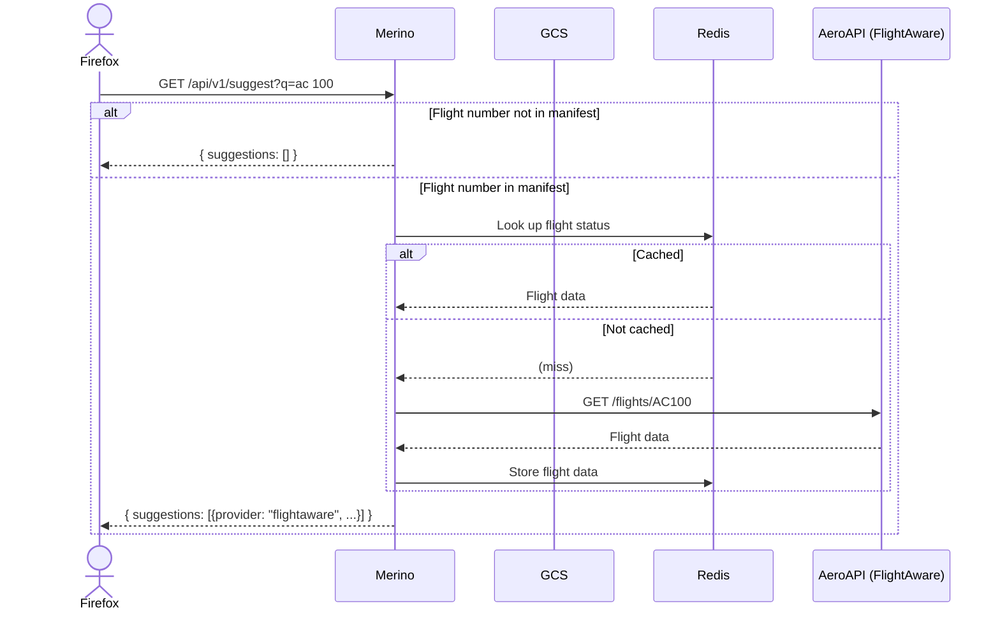
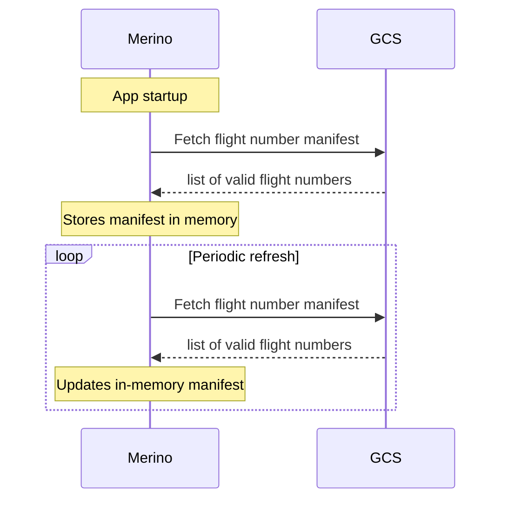
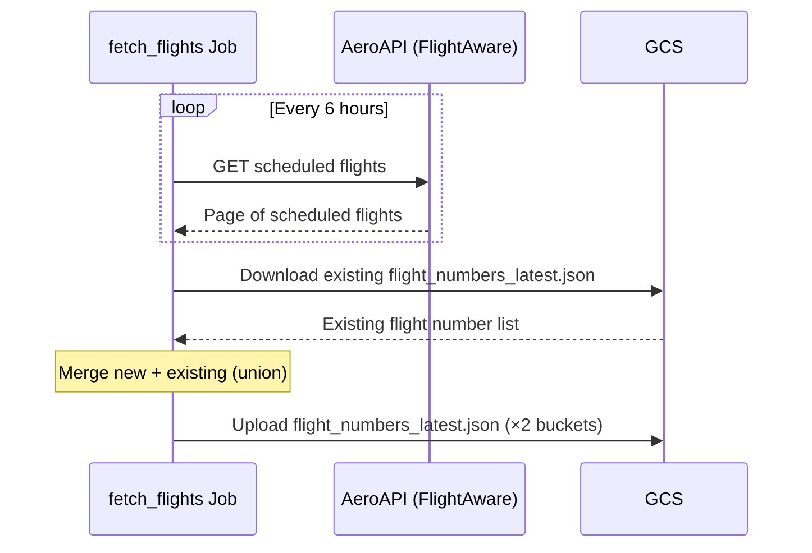

# Flight Status Provider

Handles flight status queries from the Firefox address bar. If the sanitized query matches a flight number in a GCS-sourced manifest, respond with flight details from a Redis cache, or live AeroAPI (FlightAware) calls on cache miss. This provider is fronted by a circuit breaker.

## Request Flow

## Flight Numbers Manifest Sync

Flight numbers are loaded into memory from GCS on app startup and refreshed periodically (see [config](../operations/configs.md#general)). This is an append-only manifest which contains all flight numbers that have been synced via the scheduled flight numbers ingestion job.

## Flight Numbers Ingestion Job (Manifest update)

This ingest job fetches flight numbers for scheduled flights from AeroAPI every 6 hours, and adds them to the existing flight numbers manifest(s) in GCS. Currently two copies of the manifests are stored in separate buckets as part of ongoing GCP v2 migration.

The job scheduling and invocation is handled by Airflow (see [dags](https://github.com/mozilla/telemetry-airflow/blob/main/dags/merino_jobs.py) here).

Note that the job can be configured to store the manifest in Redis by setting `settings.flightaware.storage` (resolves to `MERINO_FLIGHTAWARE__STORAGE` env var) to `redis`. However, the provider is only configured to fetch the manifest from GCS.
